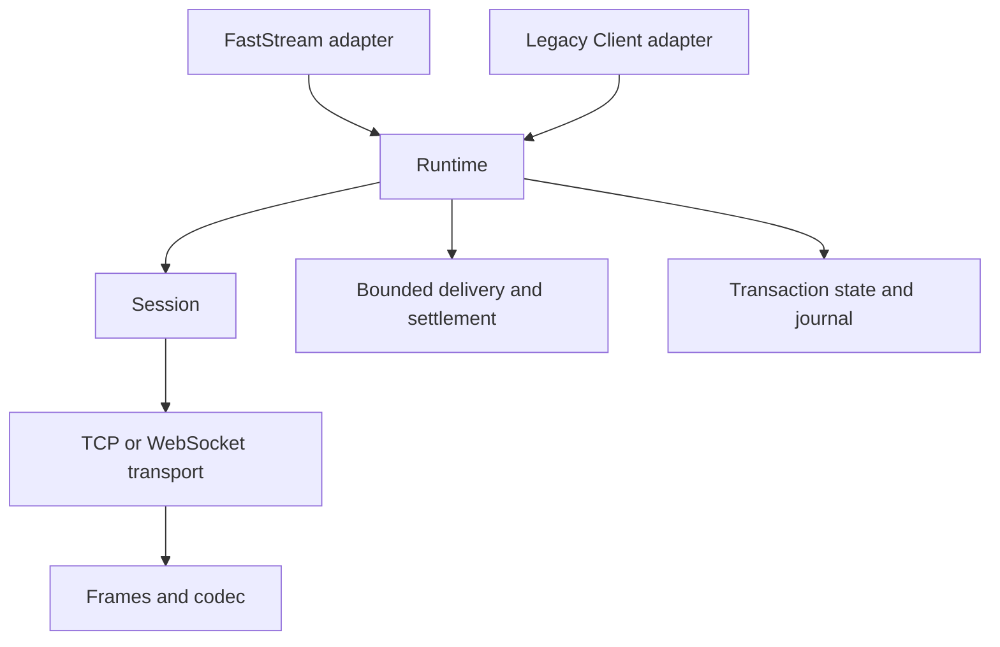

# Session core and adapters

FastStream is the primary facade. Its producer, subscriber and lifecycle code use
`stompman.core.Runtime` directly. `stompman.Client` is a separate compatibility
adapter. Supplying a Client to StompBroker extracts its configuration once; it
does not execute Client methods or share the Client's lifecycle.

Runtime owns desired subscriptions, serialized recovery and operations, bounded
delivery admission, and transaction state. A Session represents exactly one
physical connection and generation. It has one continuous reader, ordered
writes, negotiated heartbeats, receipt correlation and deterministic cleanup.
Frames, configuration and errors are shared leaf modules; the core never imports
the legacy Client, subscription adapter, transaction adapter, manager or lifespan.

## Compatibility

Keep the current Client constructor options, dataclass extension, context manager,
send/begin/subscribe methods, callbacks, ACK modes and custom headers. Normal
Client context exit continues waiting for subscriptions to be removed. Preserve
Connection.connect, read_frames, write_frame, close, reader/writer fields and
custom Connection subclasses. Preserve the actual legacy AckableMessageFrame
class identity, including messages passed to FastStream consumers. Preserve
mutable StompPublishCommand headers, routers, middleware, testing helpers,
subscriber specifications and content-length overrides.

The old private manager/lifespan graph is replaced. Tests and diagnostics should
use Runtime's observable status, scripted transports and wire frames. Older major
versions of stompman or FastStream require their existing version migration;
this change does not restore APIs removed in previous releases.

## Delivery and failure semantics

Unconfirmed SEND keeps bounded write retries; a network failure may therefore
produce duplicates. Optional receipt confirmation correlates the exact receipt
and reports timeout or loss, without automatically repeating an uncertain send.
Receipt confirmation means broker acceptance, not consumer processing.

An open transaction is restored with BEGIN and an immutable send journal. It is
never committed before its context exits, and a failed triggering SEND appears
once in the replacement session. COMMIT is never replayed after an ambiguous
write or missing receipt; TransactionOutcomeUnknownError exposes the uncertainty.
Applications requiring deduplication must provide application message identifiers.

Cumulative client ACK/NACK settlement waits for the completed prefix of deliveries.
Settlement from an obsolete generation, removed subscription or already settled
delivery never writes to a new session. Unhandled handler exceptions are logged;
the connection stays usable.

Admission is bounded by message count and bytes, including unsettled deliveries.
Handler saturation does not block the session reader, receipts, ERROR frames or
heartbeats. Exhausting admission raises a distinct ConsumerOverloadedError and
closes the session; it is a local capacity failure, not a heartbeat failure.
Configure broker credit/prefetch and application capacity together. With STOMP
auto ACK, a connection failure can lose messages already accepted by the broker;
use client-individual ACK for recoverable delivery.

Heartbeat intervals follow STOMP's max/zero negotiation. The session watchdog
observes transport read activity independently of handlers. A disabled receive
heartbeat does not make a healthy connection appear dead. Failed handshake
candidates and losing connection attempts are closed and awaited.

Cancellation during an active transport write invalidates the session because
broker state may already have changed. Cancellation before acquiring the write
lock or while awaiting a receipt leaves the connection usable. Owned cleanup
finishes before caller cancellation propagates, including repeated cancellation.

## Migration sequence and validation

1. Add the independent core and behavioral tests at its transport seam.
2. Replace Client execution with a legacy adapter and preserve consumer-shaped contracts.
3. Move FastStream execution to the core; test it with Client execution patched to fail.
4. Retain codec, configuration, typing, middleware and broker integration coverage;
   replace tests that assert the discarded private object graph.
5. Run both asyncio backends, type/lint/build checks and isolated broker tests.

No consumer deployment or dependency upgrade is performed as part of this change.

## Adoption

New FastStream applications can construct `StompBroker(servers=[...])` directly,
pass `RuntimeConfig(...)` for connection and capacity settings, or supply an owned
`Runtime`. Existing `StompBroker(Client(...))` calls keep working by taking a
configuration snapshot. A Client subclass that overrides send or connection
lifecycle methods must migrate those customizations to middleware or a transport
adapter; FastStream deliberately does not execute that subclass.

Existing direct consumers can retain Client unchanged. `client.core.status`
replaces inspection of the private manager graph. `client.core.reconnect()` is an
explicit recovery operation useful for operational checks. Raw Connection,
FrameParser and frame consumers remain supported.

Tests injecting `broker.config.broker_config.client` or `StompProducer(client=...)`
should inject a Runtime or a mock with its interface. `TestStompBroker` remains the
preferred in-process testing helper. Its publish command remains mutable so
middleware can add headers before serialization.

Publish stompman 3.15.0 or newer before publishing this faststream-stomp release;
the adapter's dependency minimum now enforces the new core's availability.

The adapter temporarily requires AnyIO below 4.15: FastDepends 3.0.8 accesses
`anyio.to_thread` without explicitly importing it, which fails with AnyIO 4.15's
lazy imports in a fresh process. Remove this bound after an upstream fix and an
installed-package smoke test. The WebSocket extra supports websockets 14 or newer.

For isolated broker testing, set `STOMPMAN_ARTEMIS_PORT` and
`STOMPMAN_CLASSIC_PORT` before both Docker Compose and pytest. The readiness script
checks STOMP handshakes on both brokers. Their default host ports remain 9000 and
9001.
