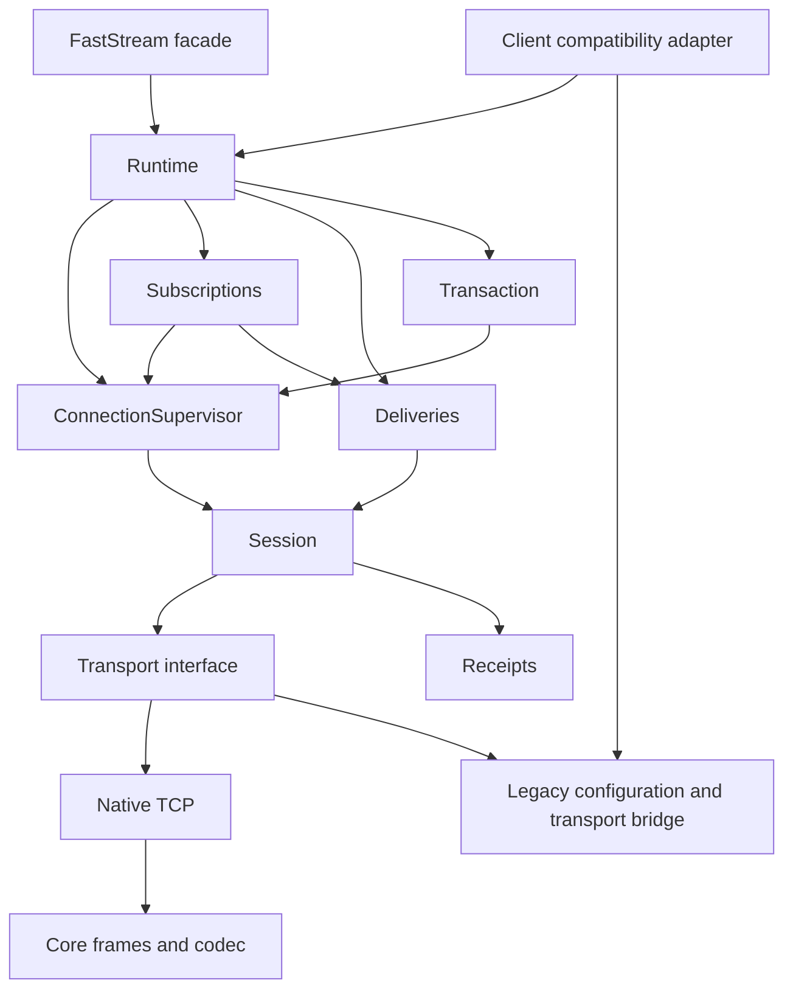

# Session core and adapters

`stompman.core` is a self-contained STOMP library. It imports its own modules and
the standard library. Importing it does not load the legacy facade. Frames, codec,
configuration, errors, TCP transport, session execution, and recovery all live in
core. The legacy `stompman.frames`, `stompman.serde`, and `stompman.errors` paths
re-export the canonical definitions, preserving class identity.

FastStream is the primary facade and executes core directly. `Client` is a
separate compatibility adapter. Supplying a Client to StompBroker takes an
independent configuration and transport snapshot; Client execution methods and
lifecycle state are not shared.



## Ownership and review map

| Module | Interface | Invariants it owns |
| --- | --- | --- |
| `Runtime` | Start, close, send, subscribe, begin, status | Complete running resources; draining handlers can still publish and settle |
| `ConnectionSupervisor` | Run a submission, reconnect, attach/detach restoration intent | Connection races, retry spacing, generation changes, consistent journal restoration |
| `Session` | Open, create a command, write, close | One transport and reader, write order, heartbeats, cancellation, deterministic cleanup |
| `Receipts` | Reserve, receive, discard, fail | Exact receipt correlation; retire correlations before rejection observers |
| `Subscriptions` / `Subscription` | Subscribe, receive, restore, unsubscribe | Immutable intent, installing/active/removed states, callback ordering, safe ID reuse |
| `Deliveries` / `Channel` | Admit, pause, drain, settle | Capacity reservations, handler scheduling, ordered settlement on the original session |
| `Transaction` | Enter, send, commit, abort | Immutable replay journal, transaction state, ambiguous commit handling |

Transactions and subscriptions implement the same small restoration interface.
They never inspect Runtime fields. Delivery settlement holds a capability tied to
its original channel and session; it cannot obtain a replacement session.

The generation gate covers session acquisition, restoration, transport submission,
and the corresponding journal update. Normal receipt waits happen after releasing
the gate, allowing unrelated commands to finish in any receipt order. Restoring a
session waits for subscription confirmations before allowing new submissions.
A command succeeds only after both transport drain and its exact receipt succeed;
a receipt arriving before a stalled drain cannot hide a write timeout.

A capacity reservation contains two obligations: handler completion and settlement.
Capacity is released when both finish. Queued deliveries, running handlers, and
completed handlers with unsettled messages all count toward admission. Channels
serialize their settlement ledger and retire old generations without redirecting
ACK/NACK. Unsubscribe waits for already requested settlements before its wire
command; graceful shutdown first pauses admission and drains running handlers.

## Native interface

Native configuration is frozen and validated at construction. Server collections
are tuples; CONNECT headers are immutable snapshots. Connection settings,
recovery policy, and delivery limits are distinct values. Credentials and endpoint
fields are required. Passwords passed to native `Server` are literal, while the
legacy adapter preserves URL decoding of `ConnectionParameters.passcode`.

```python
from stompman.core import (
    Confirmed,
    Delivery,
    DeliveryLimits,
    Runtime,
    RuntimeConfig,
    Server,
)

config = RuntimeConfig(
    servers=(Server("localhost", 61616, "guest", "guest"),),
    delivery=DeliveryLimits(concurrency=32, pending_messages=512),
)


async def handle(message: Delivery) -> None:
    print(message.body)
    await message.ack()


async with Runtime(config) as runtime:
    subscription = await runtime.subscribe("events", handle)
    receipt = await runtime.send(b"hello", "events")
    await runtime.send(b"custom deadline", "events", confirmation=Confirmed(10))
    async with runtime.begin() as transaction:
        await transaction.send(b"one", "events")
        await transaction.send(b"two", "events")
    await subscription.unsubscribe()
```

SEND, SUBSCRIBE, ACK/NACK, UNSUBSCRIBE, and transaction operations wait for broker
receipts by default, with a five-second operation deadline. DISCONNECT has its
own connection setting. Confirmation proves broker acceptance, not consumer
processing. A timeout includes transport submission and receipt waiting after a
connection becomes available. Confirmed publication never retries an ambiguous
write automatically.

`Unconfirmed(attempts=3)` explicitly selects write-only delivery with bounded
retries and possible duplicates. The default `Unconfirmed()` makes one attempt.
A subscription's `confirmation` controls installation and restoration;
`operation_confirmation` controls its settlement and removal. A transaction's
`confirmation` controls BEGIN, SEND, and ABORT; `commit_confirmation` controls
COMMIT. All of these default to `Confirmed()`.

An open transaction is restored with BEGIN and a private immutable send journal.
These reconstruction writes remain inside the transaction and use write-only
submission; the eventual confirmed COMMIT determines acceptance. The triggering
SEND enters the journal once, after its transport submission succeeds. COMMIT is
removed from restoration before it reaches the wire. Missing confirmation or
connection loss during COMMIT raises `TransactionOutcomeUnknownError`; COMMIT is
never blindly replayed.

By default, reconnect attempts are bounded and a quiet subscription does not
cause idle reconnects. Heartbeats still detect a dead peer. `ConnectionSettings`
can enable an idle deadline and configure TLS, heartbeat tolerance, read size,
and connection deadlines. `RecoveryPolicy` controls retry count, spacing, and
whether background recovery keeps trying after exhausting one cycle.

`RuntimeStatus` exposes generation, health, pending message/byte counts, running
handlers, subscription IDs, outstanding receipts, and active transport writes.
Applications need not inspect internal session or subscription dictionaries.
During restoration, status remains `recovering` and `is_alive()` is false.
The generation advances only after restoration finishes; receipt and write
diagnostics still describe the session being restored.

## Compatibility and FastStream

Client retains its constructor fields, dataclass extension, methods, callback
shapes, and context behavior. Normal Client context exit waits for subscriptions
to be removed. `_compat.LegacyOptions` translates old flat options into native
configuration and explicitly chooses unconfirmed operation policies. The core
contains no legacy fallback detection.

Both Client subscription methods retain `receipt_timeout` and
`on_subscription_error`. Receipt confirmation is opt-in on this facade only.
`SubscriptionError` retains the reasons rejected, timeout, connection_lost, and
unsubscribed; raw ERROR frames are excluded from its representation. Failed
intent and receipt correlation are removed before callbacks. Callback exceptions
are logged and suppressed. Confirmed subscriptions restore with fresh receipt IDs;
failed or still-unconfirmed installations do not replay. Legacy write-only
subscriptions retain their restoration behavior.

The legacy transport bridge preserves custom Connection classes, `connect()`
returning None on failure, wall-clock `last_read_time`, synchronous heartbeat
fallbacks, WebSocket paths, and TLS. Existing raw Connection, WebSocketConnection,
FrameParser, and frame users keep their interfaces. A custom native transport
implements `Transport` and is supplied through `Runtime(transport_factory=...)`.
Its factory returns a connected transport or raises; it never returns None.

FastStream accepts `StompBroker(RuntimeConfig(...))`, an owned Runtime, or
`StompBroker(servers=[ConnectionParameters(...)])`. Native configuration can be
paired with an explicit `transport_factory`. Existing `StompBroker(Client(...))`
continues working while using native execution and confirmed defaults. Custom
Client execution overrides should move to middleware or a transport adapter.

FastStream continues delivering the actual `stompman.AckableMessageFrame` class.
Publish command headers remain mutable for middleware. Router, subscriber
specification, publisher, reply metadata, content-length overrides, and
`TestStompBroker` contracts remain covered by their existing tests.

## Validation

Tests import core with every legacy module blocked and relocate it under a
different package name, then perform a confirmed TCP publication. Behavioral
regressions cover independent receipt waits, cancellation at each write phase,
restoration, stale settlement, capacity, cumulative ACK/NACK, replacement IDs,
transaction replay, and graceful draining. FastStream tests disable Client
execution methods while exercising core publication, handlers, replies, restart,
and shutdown. Integration suites use both asyncio backends and both brokers.

Set `STOMPMAN_ARTEMIS_PORT` and `STOMPMAN_CLASSIC_PORT` before Docker Compose and
pytest when using isolated broker ports. Run `scripts/wait_for_stomp_brokers.py`
before the integration suite. Tests on different Python versions must run
sequentially against shared brokers.

Publish stompman 3.16.0 or newer before this faststream-stomp release. The adapter
requires that version for core. Its temporary AnyIO <4.15 bound remains necessary
until FastDepends imports `anyio.to_thread` explicitly; verify an installed-package
smoke test before removing it. The WebSocket extra supports websockets 14 or newer.
